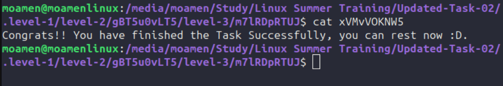

1. First i have to unzip the task file

2. To locate a file i cant see i need to press Ctrl + h

3. To extract tar file we need to write (tar -xvf .level-1.tar)
	x to say that i want to extract
	v to make the command outputs what is done
	f to specify the file

	
4. Now i found a file "level-2" that needs to be extracted but it have to extension so i want to see what kind of compression it is
i can use then the command "file level-2" to see what it is
found that it is a gzip file that was before that a tar file
so i need to rename it to put the .tar.gz extension in it

5. now we need to uncompress this file by command (tar -xvf level-2.tar.gz)

6. after decompression i found a lot of files and i wanted to open the next README.md file so i simply used (cat README.md) to open the file and see its content because i could not find it by my eyes

7. now i have to find level-3 in the extracted folder i can see it using the -v option in tar as i provided it with the screenshot but i can also use the find command to look for it (find -name level-3) and i found it

8. So you need me to uncompress it with general way i didn't know what you mean by general way but when i type (tar -xvf level-3) it decompress it so that good.

9. i searched for the README.txt file again

10. to file the link i typed (ls -l) and search for a file type (l) and found it!

11. i (cat) the file to see it's content and find that i am searching for a file with 73 byte size

12. to search for the file i can use (find -size 73c)  
	c is to say that the size is with byte

13. i found it then change the directory to it and (cat) the file and finally the task is finished <3
