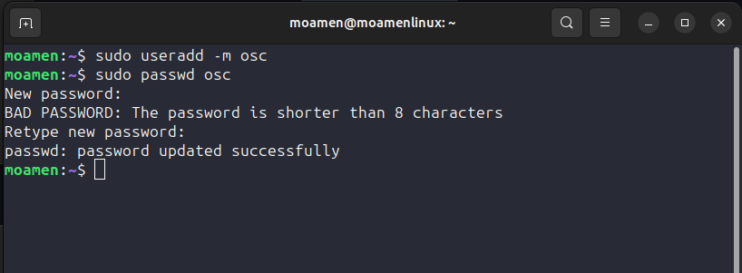
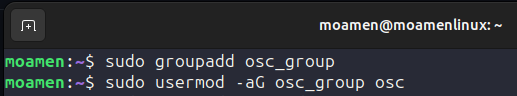
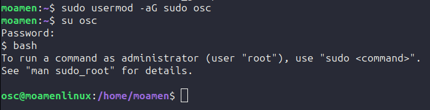
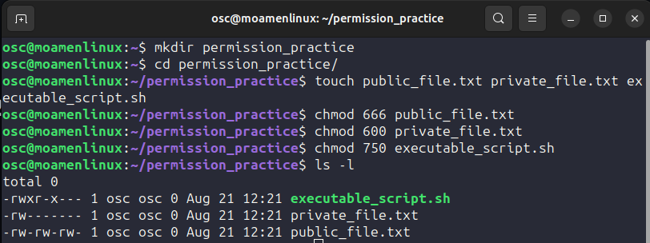
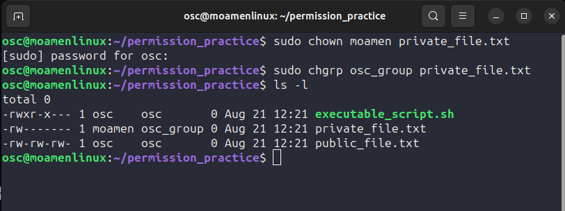
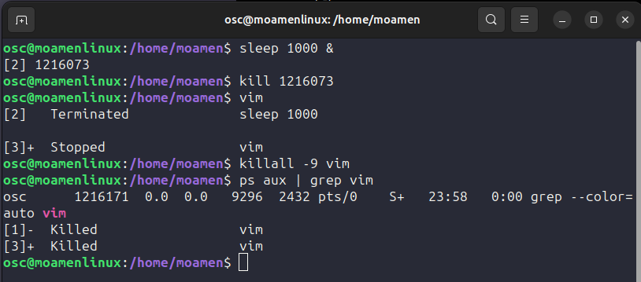
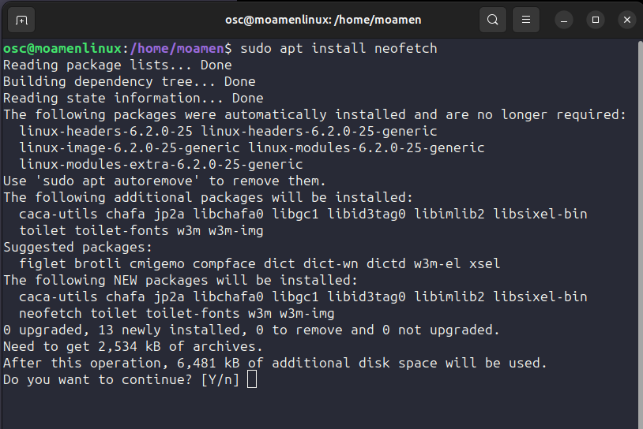
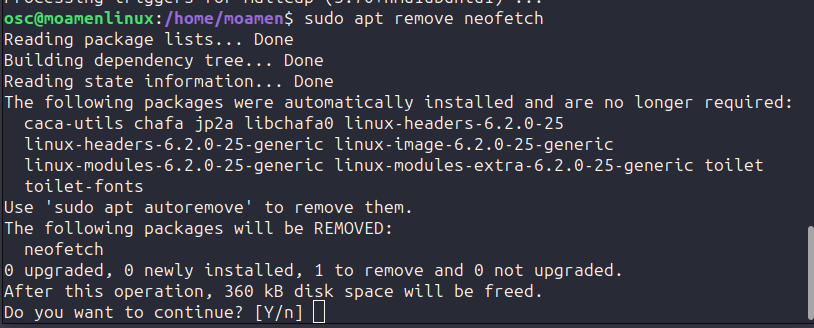

1. To create new user called osc i can use (sudo useradd -m osc)
	-m is to make a default home directory for this user

2. to change the password of this user i can use (sudo passwd osc) and then type the new password

3. To add new group i can use (sudo groupadd osc_group) and then to add the osc user to this group i can use (sudo usermod -aG osc_group osc)
	-a to use append mode
	-G to add to supplementary group

4. to give osc use the sudo privileges i can use (sudo -aG sudo osc) and then use (su osc) and then write the password i made to switch to this user

5. make directory using (mkdir) and the files using touch

6. Give the public_file.txt premissions 666 to give read write permissions to the file 6 -> 4(read) + 2(write)

7. Give Private_file.txt premissions 600 to give owner only the read write permissions permissions to the file 6 -> 4(read) + 2(write) and 0 for no permissions

8. Give the executable_script.sh premissions 750 to give read write execute permissions to the owner 7 -> 4(read) + 2(write) + 1(execute) and 5 -> 4(read) + 1(execute) to the group and 0 for others to give them nothing

9. change the owner of the private_file.txt file by typing (sudo chown moamen private_file.txt) then type the password for sudo
	sudo: because change the owner require superuser
	
10. change the group of private_file.txt file by using (sudo chgrp osc_group private_file.txt)

11. to make a background process that runs sleep 1000 we can use (sleep 1000 &) & is to make it run in background

12. the PID will appear after making the previous command we can use it to kill the process by (kill 1214575)

13. type vim to open it and then ctrl+z to suspend it

14. use killall -9 vim to kill the process of it and then use (ps aux | grep "vim") to check if it killed
	-9 to force the process to be killed without any chance to clean up

	
15. use (sudo apt install neofetch) to install the neofetch package then press y and enter to make it install

16. use (sudo apt remove neofetch) to uninstall the nerfetch package then press y then enter to make it remove
